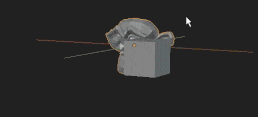
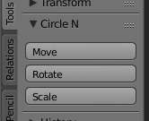
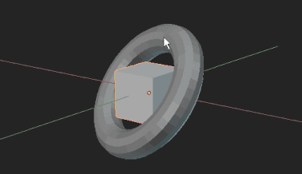
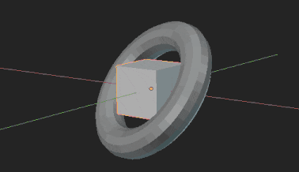
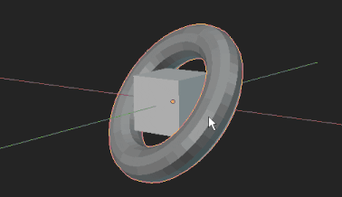
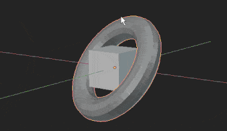
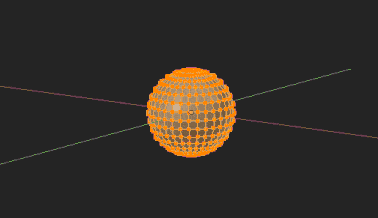
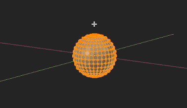
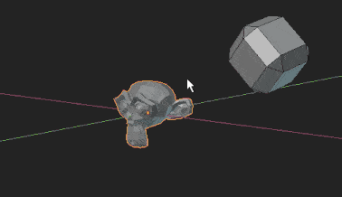

[[Readme in English](./README.md)]

---

# Circle N

Blender Addon # サークルベースGUIのフリーアングルなマニピュレータ

> [**Download circle_n.zip**]()

## インストール
1. `Blender User Preference` > `Install from File` > ダウンロードした `circle_n.zip` を選択
2. アドオンリスト中の `3D View: Circle N` を有効化

## 使い方

3D View での次の編集モードに対応しています:
- Object モード
- Mesh/Curve/Arumature それぞれにおける Edit モード
- Pose モード

上記編集モードにて変形対象となるもの(Objectモードならオブジェクト、Edit Meshモードなら頂点や辺・面等)を選択した状態で、
パネルにある `Move` `Rotate` `Scale` いずれかのボタンを押す、もしくはホットキー入力で CircleN が起動します。
デフォルトのホットキーは `Q` キーで `Move` モードが起動するよう設定されています。

  
*(3D View) Circle N パネル*

### モード共通操作
- `マウス移動` : CircleN の軸方向を設定
- `マウス右ドラッグ` / `Shift + マウス右ドラッグ` : 軸方向に対してモードに応じた変形を行う (後述)
- `マウス左クリック` : 確定＆終了
- `Esc`キー : キャンセル
- `C`キー : キャプチャ -- マウスカーソル下にあるオブジェクトの面の方向に CircleN の軸方向を固定 (後述)
- `Q`キー : モード切り替え -- `Move` -> `Rotate` -> `Scale` -> `Move` ... の順でトグル
- `G` `R` `S` キー : それぞれ `Move` `Rotate` `Scale` へモード移行

---

### `Move` モード

対象を移動します。

- `マウス右ドラッグ` : CircleN 軸方向に移動

  

- `Shift + マウス右ドラッグ` : 軸方向に直行する平面方向に移動

  

---

### `Rotate` モード

対象を回転します。
- `マウス右ドラッグ` : ドラッグに合わせて CircleN 軸の方向が代わり、それに伴い対象も軸に固定される形で回転される

  

- `Shift + マウス右ドラッグ` : 軸方向まわりの回転を行う

  

---

### `Scale` モード

対象を拡縮します。

- `マウス右ドラッグ` : 軸方向に拡大/縮小

  

- `Shift + マウス右ドラッグ` : 軸方向に直行する平面方向に拡大/縮小

  

---

### キャプチャ

`C` キー押下でマウス下にあるメッシュオブジェクトの面の向きをキャプチャします。 軸の向きが対象の面の法線方向に固定されます。

`Rotate` モードでキャプチャを行った場合は軸回りの回転だけが有効になります。
(`マウス右ドラッグ`の操作は`Shift + マウス右ドラッグ`と同じ結果になる)
